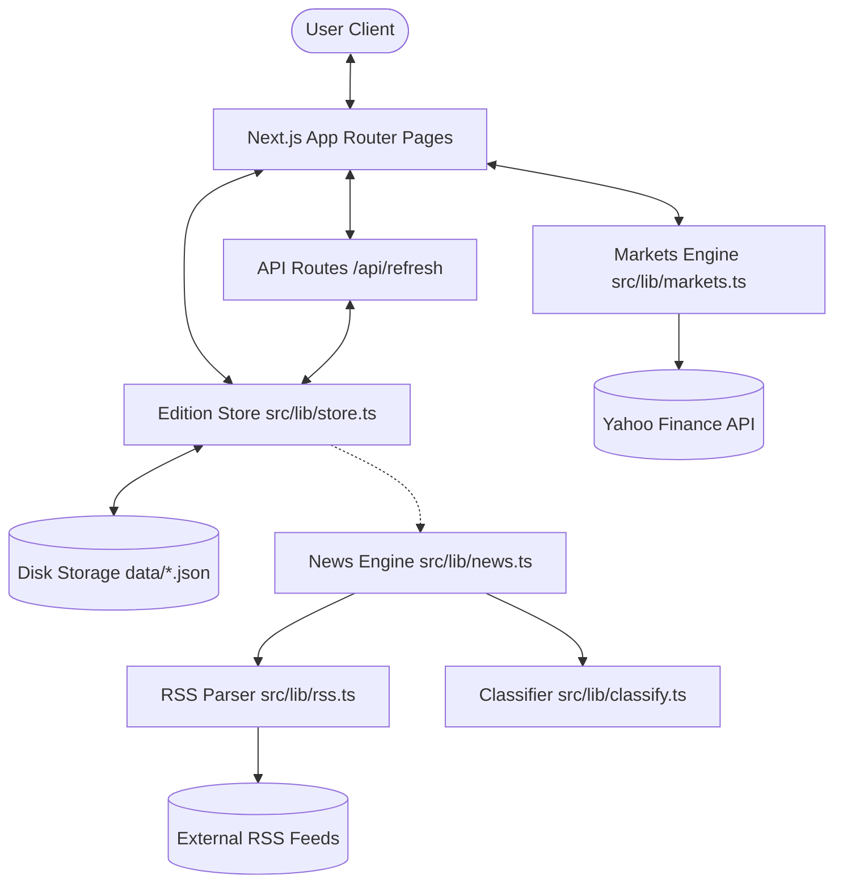

# The Chronicle — System Architecture and Developer Manual (brain.md)

This document is the single source of truth for **The Chronicle**, a Next.js 16 publication engine that crawls, filters, ranks, and archives financial news from trusted Indian business outlets. It outlines the design patterns, system architecture, data models, algorithms, and maintenance guidelines.

---

## 1. Project Purpose
The Chronicle is a daily digital newspaper focused on Indian finance, markets, corporate actions, and economic policy.
* **Goal**: Provide a clean, distraction-free, highly curated paper of the day's critical market movements.
* **Target Audience**: Financial analysts, investors, public policy observers, and business leaders.
* **Core Philosophy**: A return to the traditional newspaper format — curated front page, clear sections, no comments, no ads, no clickbait. 

---

## 2. High-Level Architecture
The Chronicle is built on Next.js 16 (App Router) and structured to run server-side without an external relational database.


---

## 3. Folder Responsibilities
```
/
├── data/                       # Local file system storage (JSON databases)
│   ├── archive/                # Historical IST day snapshots (YYYY-MM-DD.json)
│   ├── summaries.json          # Cached 100-word article briefs (keyed by article id)
│   └── current.json            # Cached active edition data
├── design_ref/                 # Design mockup images and reference layouts
├── src/
│   ├── app/                    # Next.js App Router pages and CSS stylesheets
│   │   ├── api/                # API Endpoints (e.g. force refresh trigger)
│   │   ├── article/            # Dynamic article view page (/article/[id])
│   │   ├── edition/            # Dynamic route parameter pages for archives
│   │   ├── section/            # Dynamic category focus views
│   │   ├── favicon.ico         # App favicon fallback file
│   │   ├── icon.svg            # App favicon vector file
│   │   ├── globals.css         # Theme declarations and Tailwind v4 config
│   │   ├── layout.tsx          # Root DOM layout, fonts, and HTML wrappers
│   │   └── page.tsx            # Newspaper front page (today's edition)
│   ├── components/             # Reusable UI component layer
│   └── lib/                    # Core engines (store, parser, classifier, definitions)
```

---

## 4. Technology Stack
* **Framework**: [Next.js](https://nextjs.org/) `16.2.10` (App Router, dynamic page-level rendering).
* **Language**: [TypeScript](https://www.typescriptlang.org/) `^5` (strict configuration, path aliases).
* **Runtime & Library**: [React](https://react.dev/) `19.2.4` & [React DOM](https://react.dev/) `19.2.4`.
* **Styling**: [Tailwind CSS](https://tailwindcss.com/) `v4` with `@tailwindcss/postcss` for theme declarations.
* **Icons**: [Lucide React](https://lucide.dev/) `^1.23.0`.
* **LLM**: [groq-sdk](https://console.groq.com/) `^1.3.0` — powers the 100-word article briefs in [summarize.ts](file:///Users/yusufamin/TheChronicle/src/lib/summarize.ts) when `GROQ_API_KEY` is set; extractive fallback otherwise.
* **Unused/Available SDKs**:
  * `recharts` `^3.9.1` (installed, available for charts but not active).

---

## 5. Dependency Graph
```
src/app/page.tsx (Front Page)
 ├── src/components/Ticker.tsx
 │    └── src/lib/markets.ts (Yahoo Finance API client)
 ├── src/components/Masthead.tsx
 │    ├── src/components/CalendarPicker.tsx (Historical dates picker)
 │    └── src/components/RefreshButton.tsx (POST to /api/refresh)
 ├── src/components/EditionView.tsx
 │    ├── src/components/Story.tsx (LeadStory, StoryCard, ListStory → link to /article/[id])
 │    └── src/components/Briefs.tsx (Cross-industry briefs)
 └── src/lib/store.ts (File-backed cache reader/writer)
      └── src/lib/news.ts (Scraper & compiler coordinator)
           ├── src/lib/feeds.ts (Definitions list)
           ├── src/lib/rss.ts (XML RSS string parser)
           └── src/lib/classify.ts (Rule-based classifier)

src/app/article/[id]/page.tsx (Article View — renders "The Brief", max 100 words)
 ├── src/components/ScrollProgress.tsx (Client-side scroll progress bar)
 ├── src/components/Ticker.tsx
 ├── src/components/Masthead.tsx
 ├── src/lib/store.ts → getArticleById()
 ├── src/lib/scrape.ts (Article content scraper + boilerplate/ad filter)
 └── src/lib/summarize.ts (condenseArticle: Groq LLM or extractive, 100-word cap, disk cache)
```

---

## 6. Execution Flow
1. **App Bootstrapping**: Standard Next.js server start.
2. **Page Loading**: Server gets request for `/`, `/section/[topic]`, or `/edition/[date]`.
3. **Cache Resolution**:
   * Reads `data/current.json`.
   * Checks age of `fetchedAt` timestamp against `12-hour` TTL.
   * If stale or missing:
     * Triggers concurrent-safe async fetching.
     * Overwrites `data/current.json` with fresh payload.
     * Merges and saves snapshot in `data/archive/[YYYY-MM-DD].json`.
4. **Rendering**: Server renders fully formed HTML with custom fonts (`Playfair Display`, `Source Serif 4`, `Inter`) and returns it to the client.

---

## 7. Request Lifecycle
### A. Viewing the Front Page (`/`)
1. User requests `/`.
2. Next.js triggers `FrontPage()` component (configured as `force-dynamic`).
3. Calls `getEdition()` from [store.ts](file:///Users/yusufamin/TheChronicle/src/lib/store.ts).
   * Checks if `data/current.json` is missing or >12 hours old.
   * Runs `refreshEdition()` if stale, falls back to stale cache on network failure.
4. Renders layout components: `Ticker`, `Masthead`, `EditionView`, `Footer`.
5. Returns completed HTML page.

### B. Accessing a Section Focus (`/section/[topic]`)
1. User requests `/section/markets`.
2. Next.js processes parameter and validates it against `TOPICS` in [types.ts](file:///Users/yusufamin/TheChronicle/src/lib/types.ts).
3. Calls `getEdition()` to extract articles and `getMarketQuotes()` to get Yahoo Finance ticks.
4. Filters the edition articles to only those matching the category.
5. Sorts stories by quality score, pulls the 3 highest scoring items from other categories to populate the "Trending Elsewhere" sidebar.
6. Returns HTML page.

### C. Triggering Data Refresh (`POST /api/refresh`)
1. User clicks the "Refresh Now" button on the Masthead.
2. Client sends a `POST` request to `/api/refresh`.
3. Server executes `refreshEdition()`:
   * Fetches external RSS feeds in parallel.
   * Deduplicates and scores new articles.
   * Saves updated snapshot to `data/current.json`.
   * Reads, merges, and writes updated history file to `data/archive/[YYYY-MM-DD].json`.
4. Server calls `revalidatePath("/", "layout")` to clear the Next.js router cache.
5. Returns JSON response: `{ ok: true, fetchedAt: ISOString, articles: count }`.

---

## 8. Database / Storage Design
The Chronicle uses a simple, highly performant file-backed JSON database system instead of an SQL/NoSQL server.
* **Storage Schema**: Located in [types.ts](file:///Users/yusufamin/TheChronicle/src/lib/types.ts):
  ```typescript
  export interface Article {
    id: string;          // 12-char SHA-1 hash of the cleaned URL
    title: string;       // Cleaned title text
    summary: string;     // Cleaned summary description (trimmed to max 320 chars)
    link: string;        // Cleaned URL without query parameters
    source: string;      // Publisher name (e.g. "Economic Times")
    publishedAt: string; // ISO 8601 timestamp
    topic: TopicSlug;    // Classified topic slug
    score: number;       // Combined quality + recency score
    image?: string;      // Lead image URL from the feed (enclosure/media:content), when provided
  }

  export interface BriefItem {
    industry: string;    // Tech / Energy / Auto / Pharma & Healthcare / Consumer
    bold: string;        // Bold lead prefix (first two words)
    rest: string;        // Remainder of the headline
    link: string;
    source: string;
  }

  export interface Edition {
    fetchedAt: string;   // ISO timestamp of crawl completion
    date: string;        // YYYY-MM-DD (IST timezone)
    articles: Article[];
    briefs: BriefItem[];
  }
  ```
* **Store Mechanics**: Implemented in [store.ts](file:///Users/yusufamin/TheChronicle/src/lib/store.ts):
  * **Safe Writes**: Avoids write corruption by writing to a temporary file (`.tmp`) first and performing an atomic rename:
    ```typescript
    const tmp = `${file}.tmp`;
    await fs.writeFile(tmp, JSON.stringify(value), "utf8");
    await fs.rename(tmp, file);
    ```
  * **Lossless Archiving**: When saving today's archive, it merges incoming articles with existing ones on disk, preventing earlier fetched articles from being deleted if they drop out of RSS feeds:
    ```typescript
    const carried = existing.articles.filter((a) => !incomingIds.has(a.id));
    edition.articles = [...newArticles, ...carried];
    ```

---

## 9. API Contracts
### `POST /api/refresh`
* **Purpose**: Force a re-fetch of RSS feeds, rebuild cache, update archive files, and revalidate layout cache.
* **Authentication**: None.
* **Response (Success - 200 OK)**:
  ```json
  {
    "ok": true,
    "fetchedAt": "2026-07-17T18:00:00.000Z",
    "articles": 84
  }
  ```
* **Response (Failure - 500 Internal Server Error)**:
  ```json
  {
    "ok": false,
    "error": "Refresh failed"
  }
  ```

---

## 10. Key Algorithms & Business Logic
### A. Native RSS XML Parsing
To keep the application fast and avoid heavy parsing dependencies, [rss.ts](file:///Users/yusufamin/TheChronicle/src/lib/rss.ts) uses a custom parser:
* Matches all `<item>` blocks via `/<item[\s>][\s\S]*?<\/item>/gi`.
* Extracts fields like `title`, `link`, `description`, and `pubDate` using custom regular expressions matching CDATA and plain text.
* Extracts an optional `image` URL per item from `<enclosure url type="image/...">` (Economic Times, TOI) or `<media:content url>` (Mint, Hindu group). Rendered by `LeadStory` (left of headline), `StoryCard` (above headline), and `ListStory` (left thumbnail) — all with graceful text-only fallback when absent.
* Decodes HTML entities (e.g. `&amp;` -> `&`, `&rsquo;` -> `’`) and strips HTML tags.

### B. Topic Classification & Quality Filtering
The logic in [classify.ts](file:///Users/yusufamin/TheChronicle/src/lib/classify.ts) acts as the editorial gate:
1. **Noise Filtering**: Automatically drops articles containing astrology, horoscope, cricket/sports, movie reviews, trading recommendations ("stocks to buy today"), general "how to" guides, and motivational/filler features ("Quote of the Day", "Psychology explains…", optical illusions, brain teasers, personality tests, "net worth of", zodiac, "top N richest" listicles). It also drops **advisory/evergreen listicles** that masquerade as finance news but carry no event: "best … funds/stocks/SIP to invest", "top N midcap stocks/mutual funds" (word allowed between the number and the noun), "MF Tracker"/"Know Your Fund Manager"/"NFO Alert" promos, "Are you 35 or older? …" advice pieces, "… deserves a place in your portfolio", and "bank holiday today?"/"are banks open" evergreens. The same `isNoise()` gate re-screens carried-over articles during archive merges in [store.ts](file:///Users/yusufamin/TheChronicle/src/lib/store.ts), so newly added patterns also purge junk already on disk.
2. **Keyword Scoring**: Evaluates the text against regular expression rules:
   * **Strong signal** (+3 points): Decisive topic match (e.g., `DRHP` or `grey market premium` matches IPOs).
   * **Weak signal** (+1 point): Contextual match (e.g., `retail portion` matches IPOs).
   * **Feed Hint Alignment** (+2 points): Matches the source feed's intended topic (e.g., markets feed).
3. **Threshold Gate**: If the best category's score is less than `2`, the article is discarded.
4. **Substantive Quality Assessment**: Adds 1 point per match for quantitative/institutional keywords (currency/cr figures, regulator names like SEBI/RBI, quarterly indicator words).

### C. Article Scraping & 60–100 Word Condensation (`/article/[id]`)
The article page never shows the publisher page as-is (no ads, no link farms):
1. [scrape.ts](file:///Users/yusufamin/TheChronicle/src/lib/scrape.ts) fetches the source HTML and strips `script/style/noscript/nav/aside/form/figure/figcaption`/comments. It then extracts the body in two stages: **(a) Times Internet layout** — Economic Times and Times of India store the body in a `<div class="…artText…">` using `<br><br>` breaks and *no* `<p>` tags, so this container is read first and split on `<br>` runs; **(b) generic** — otherwise it isolates the `<article>` container and collects `<p>` blocks (Mint, BusinessLine, The Hindu). Every candidate paragraph passes `cleanParagraph()`, which strips photo/credit fragments and rejects anything under 40 chars, a navigation/label prefix, or matching `isNoiseText()`. `isNoiseText()` (the single source of truth, reused by the summarizer) unions three word-boundary-safe patterns: `BOILERPLATE` (also-read/app promos/`\bsubscribe\b`/newsletter/disclaimers/cookie-ToS), `WIDGET_NOISE` (audio/player labels like "Listen to this article in summarized format", "read in app"), and `PROMO_NOISE` (recommendation carousels: "ET Prime", "Stories you might like", "Recommended for you"). This is why ET pages no longer render the "ET Prime" teaser block as the article.
2. [summarize.ts](file:///Users/yusufamin/TheChronicle/src/lib/summarize.ts) `condenseArticle()` produces "The Brief": **between 60 and 100 words** (`MIN_WORDS`/`MAX_WORDS`), preserving key facts (who/what/figures/dates/regulators/quotes). `chooseBriefSource()` builds the brief from whichever of the cleaned scraped body or the RSS summary carries more usable words (defensively re-filtering with `isNoiseText()`), so a short/broken scrape falls back to the clean RSS summary. Groq LLM (prompted for 60–100 words) when `GROQ_API_KEY` is set; otherwise extractive (leading sentences — news follows the inverted pyramid). `capAtWordLimit()` cuts at sentence boundaries using a decimal-safe splitter (`(?<=[.!?]["'’”]?)\s+(?=[A-Z“"'‘₹$])`, so "10.5%" never splits).
3. Results cached in `data/summaries.json` (atomic write, 2000-entry cap, in-memory layer). The cache is **self-healing**: `isValidBrief()` runs on both read and write — a cached brief is served only if it still passes validation (no `isNoiseText` leakage, ≤100 words, and ≥60 words unless the source genuinely had less), otherwise it is regenerated; and a freshly produced brief is only persisted when valid. Page renders the brief with an attribution note and a "View Source" link to the original.

### D. De-duplication and Scoring
To prevent news duplication on the front page, [news.ts](file:///Users/yusufamin/TheChronicle/src/lib/news.ts) performs:
* **Link De-duplication**: Filters out duplicate links after stripping query params.
* **Similarity-Based Headline De-duplication**: The same event is reported by ET, Mint and BusinessLine with different figures and verbs ("rises 22.5% to ₹5,480" vs "climbs 26% to Rs 4,123"), so an exact-signature key never matched and the paper showed the story 2–3 times. The engine now compares each incoming headline against every already-accepted one via `isDuplicate()`, using several token sets built by `buildSig()`:
   * `all` — all significant tokens (length ≥ 3, not a number, not a grammatical `STOPWORD`).
   * `body` — `all` minus the `GENERIC` finance vocabulary (bank/profit/results/crore/YoY/operating/…). This is the *distinctive* content.
   * `key` — the **leading entity**: the opening run of capitalised name words (`leadEntity()`), stopping at the first lowercase word or number (usually "Q1"/"results"). Headlines lead with their subject, so this isolates *who* the story is about and ignores trailing verbs/metrics ("margins expand", "operating profit") that would otherwise make two reports of the same result look different.
   * `lit` / `der` — acronyms written literally (e.g. `PNB`) vs. implied by a run of ≥3 capitalised words (`Punjab National Bank` → `pnb`).
   * `earn` — whether the headline is a quarterly-results story (`isEarnings()`).

   Two stories are duplicates when **any** of these hold (`jaccard()` = intersection/union):
   1. **Subject + content**: `jaccard(key) ≥ 0.6` **and** `jaccard(all) ≥ 0.4`.
   2. **Same earnings event**: `jaccard(key) ≥ 0.6`, both are earnings stories, and `jaccard(all) ≥ 0.25` — a firm reports a given quarter once, so differing phrasing across sources is one event (e.g. BusinessLine's "as lower provisions boost earnings" vs ET's "jumps 23% YoY to ₹7,114 crore").
   3. **Acronym bridge**: one headline abbreviates an organisation the other spells out (`sharesAcronym()`) **and** `jaccard(all) ≥ 0.3` (PNB vs Punjab National Bank).
   4. **Distinctive-content overlap**: `jaccard(body) ≥ 0.6` — near-identical wording once boilerplate is stripped; catches re-framings the subject axis misses (parent vs subsidiary/deal, e.g. "JSW One Platforms IPO…" vs "JSW Steel to raise ₹811 crore through JSW One IPO"). Using `body` (not `all`) keeps *different* banks' results apart, since their overlap is entirely generic earnings template.

   Two-word entities protect against subsidiary false-merges: "HDFC Bank" `{hdfc}` vs "HDFC Life" `{hdfc, life}` scores `jaccard(key) = 0.5 < 0.6`, and "Bajaj Finance" vs "Bajaj Finserv" scores `0.33`, so they are correctly kept distinct.
* **Recency Bonus**: Adds a score bump to keep coverage fresh:
   * Age < 3 hours: +2 points.
   * Age < 8 hours: +1 point.
* **Sorting & Diversity Capping**: Within each topic, articles are sorted by `score` descending then `publishedAt` descending, then passed through `diversify()` before the `PER_TOPIC_LIMIT` (14) cut. During earnings season a finance feed is otherwise a wall of bank Q1 results; `diversify()` admits stories greedily by score while enforcing:
   * `ENTITY_CAP = 2` — at most two stories about the same company (keyed by `entityKey()`, which also acronym-normalises so "PNB" and "Punjab National Bank" count as one company).
   * `EARNINGS_CAP = 5` — at most five quarterly-results stories per section, so RBI/UPI/insurance/credit-growth items are not crowded out.
   Two fill passes then run — first relaxing the earnings cap, then all caps — so a section is never left short of `PER_TOPIC_LIMIT`.

---

## 11. Configuration
* **Next.js Config**: [next.config.ts](file:///Users/yusufamin/TheChronicle/next.config.ts) is minimal.
* **PostCSS**: Configured in [postcss.config.mjs](file:///Users/yusufamin/TheChronicle/postcss.config.mjs) to parse `@tailwindcss/postcss`.
* **TypeScript Compiler Settings**: Configured in [tsconfig.json](file:///Users/yusufamin/TheChronicle/tsconfig.json):
  * Target: `ES2017`
  * Strict mode enabled (`"strict": true`).
  * Absolute path alias mapping: `@/*` -> `src/*`.
  * Excludes `node_modules` and `design_ref`.

---

## 12. Environment Variables
* **`GROQ_API_KEY`** (optional, read in [summarize.ts](file:///Users/yusufamin/TheChronicle/src/lib/summarize.ts)): enables abstractive 100-word article briefs via Groq (`llama-3.3-70b-versatile`, temperature 0.2, 25s timeout, 1 retry). Put it in `.env.local`. Without it, the summarizer silently falls back to extractive mode (leading sentences of the scraped article, sentence-boundary cut). The engine used is recorded per entry in `data/summaries.json` (`"groq"` / `"extractive"`), so briefs can be regenerated by deleting that file after adding a key.

---

## 13. Coding Standards
* **Visual Styling Constraints**:
  * Traditional typography (serif headers, clean sans metadata).
  * Masthead title "THE CHRONICLE" must stay bold and on a single line: `font-black whitespace-nowrap` inside a `lg:grid-cols-[1fr_auto_1fr]` grid (the `auto` middle column sizes to the title; equal thirds would force a wrap). Note Tailwind has no `font-800` class — use `font-extrabold`/`font-black`.
  * The design rules forbid rounded corners. Border radius is forced to 0 everywhere:
    ```css
    * { border-radius: 0 !important; }
    ```
  * Custom palettes declared as CSS variables under `@theme` inside [globals.css](file:///Users/yusufamin/TheChronicle/src/app/globals.css).
  * **Section Divider Spacing**: Divider lines (like `TopicRule`) must be separated from their underlying article grid containers using a top margin (`mt-6` or 24px) to prevent images/text from touching the borders. Grid items (`ListStory`) must use uniform vertical padding (`py-8`) and avoid conditional top padding overrides (like `first:pt-0`) to maintain column alignment.
* **Strict TypeScript**: Types must be declared explicitly. Any type casting should be avoided in favor of type assertions/guards.
* **Rendering Model**: All pages use `"force-dynamic"` to ensure calculations and feed fetches happen at request-time on the server.

---

## 14. Naming Conventions
* **Files & Directories**:
  * Next.js pages/layouts/API endpoints: `page.tsx`, `layout.tsx`, `route.ts`.
  * Components: PascalCase (e.g., `EditionView.tsx`, `Briefs.tsx`).
  * Library code: lowercase and camelCase (e.g., `classify.ts`, `rss.ts`).
* **Variables & Functions**:
  * React Components: PascalCase (e.g., `function LeadStory()`).
  * Functions/Methods: camelCase (e.g., `function getEdition()`).
  * Constants: UPPER_SNAKE_CASE (e.g., `const REFRESH_INTERVAL_MS`).

---

## 15. Reusable Patterns
### A. Inflight Request Locking
To avoid redundant concurrent processing when multiple requests trigger a background refresh simultaneously, [store.ts](file:///Users/yusufamin/TheChronicle/src/lib/store.ts) caches the active refresh Promise:
```typescript
let inflight: Promise<Edition> | null = null;

export async function refreshEdition(): Promise<Edition> {
  if (!inflight) {
    inflight = (async () => {
      try {
        // ... fetching logic ...
      } finally {
        inflight = null;
      }
    })();
  }
  return inflight;
}
```

### B. Ticker Marquee Animation
The market ticker (`Ticker.tsx`) is a continuously scrolling marquee. Three identical quote rows are rendered inside a `w-max` flex container; the `ticker-scroll` keyframes in [globals.css](file:///Users/yusufamin/TheChronicle/src/app/globals.css) translate it by exactly one row width (`calc(-100% / 3)`) over 36s for a seamless loop. Hover pauses it (`group-hover:[animation-play-state:paused]`); `motion-reduce:animate-none` respects reduced-motion preferences. Duplicate rows carry `aria-hidden`.

### C. In-Memory Quote Cache
Yahoo Finance quotes are requested frequently on page loads. [markets.ts](file:///Users/yusufamin/TheChronicle/src/lib/markets.ts) implements an in-memory cache with a 5-minute TTL:
```typescript
let cache: { at: number; quotes: MarketQuote[] } | null = null;
const TTL_MS = 5 * 60 * 1000;
```

---

## 16. Error Handling
* **Data Write Failures**: Handled via `.tmp` file fallback and renaming.
* **Scraper Request Timeout**: Both RSS fetching and Yahoo Finance calls enforce strict abort timeouts (`AbortSignal.timeout(12000)` and `AbortSignal.timeout(8000)`).
* **Empty Scrapes**: If a network glitch results in 0 parsed articles, the engine skips writing to disk to prevent clearing the existing cache.
* **UI Resilience**: If an archived date does not exist on disk, a descriptive fallback screen is rendered to prompt selection of another date.

---

## 17. Security Practices
* **Input Validation**: Path parameters like `date` are validated against strict regex:
  ```typescript
  if (!/^\d{4}-\d{2}-\d{2}$/.test(date)) notFound();
  ```
* **User Agent Identifiers**: All remote requests utilize specific User-Agent strings (e.g. `Mozilla/5.0 (TheChronicle/1.0)`) to maintain transparency with target news servers.
* **External Anchor Tags**: All output links to publishers use `target="_blank"` and `rel="noopener noreferrer"`.

---

## 18. Performance Considerations
* **Parallel Scrapes**: Feeds are requested in parallel using `Promise.allSettled()` to prevent one slow publisher from blocking the entire pipeline.
* **Lightweight XML Engine**: Parsed using optimized regex matches instead of invoking heavy node XML DOM engines.
* **Server Cache**: High-impact rendering nodes use the file-backed cache to keep page response times under 50ms.

---

## 19. External Integrations
* **RSS Publishers**: Indian business news outlets configured in [feeds.ts](file:///Users/yusufamin/TheChronicle/src/lib/feeds.ts):
  * *Economic Times* (Markets, Finance, Banking, Economy, IPOs, World News, Tech, Energy, Auto, Healthcare/Biotech, Consumer)
  * *Livemint* (Markets, Economy, Companies, Money, Insurance)
  * *Moneycontrol* (Business, IPOs, Market Reports, Economy)
  * *The Hindu / BusinessLine* (Markets, Banking, Economy, IT)
  * *Times of India* (Business)
* **Market Indices**: Yahoo Finance Chart API (`https://query1.finance.yahoo.com/v8/finance/chart/...`) fetching index performance for:
  * NIFTY 50 (`^NSEI`)
  * SENSEX (`^BSESN`)
  * BANK NIFTY (`^NSEBANK`)
  * S&P 500 (`^GSPC`)
  * NASDAQ (`^IXIC`)
  * USD/INR exchange rate (`INR=X`)
  * BRENT Crude Oil (`BZ=F`)
  * Gold prices (`GC=F`)

---

## 20. Testing Strategy
* **Automated Tests**: Unknown. There are currently no automated unit tests, integration tests, or end-to-end tests configured in the project.

---

## 21. CI/CD Pipeline
* **Build / Deploy Workflows**: Unknown. There are no CI/CD configuration files (like GitHub Actions, CircleCI) defined in the repository.

---

## 22. Deployment
* **Hosting**: The project compiles to a production Next.js bundle via `next build` and can be served on any Node.js hosting platform (Vercel, AWS ECS, VPS) using `next start`. 

---

## 23. Common Commands
* **Start Dev Server**: `npm run dev`
* **Production Build**: `npm run build`
* **Run Build Locally**: `npm run start`
* **ESLint Verification**: `npm run lint`

---

## 24. Important Files
* [types.ts](file:///Users/yusufamin/TheChronicle/src/lib/types.ts): Data structure definitions and categories.
* [feeds.ts](file:///Users/yusufamin/TheChronicle/src/lib/feeds.ts): Hardcoded feed configurations.
* [classify.ts](file:///Users/yusufamin/TheChronicle/src/lib/classify.ts): Editorial ranking and noise filtration rules.
* [store.ts](file:///Users/yusufamin/TheChronicle/src/lib/store.ts): Cache management, file reads/writes, concurrent locks.
* [news.ts](file:///Users/yusufamin/TheChronicle/src/lib/news.ts): Feeds compilation and article scoring.

---

## 25. Known Limitations
1. **No External Database**: All state resides on the local disk. Re-deployments to ephemeral containers (e.g. basic AWS Fargate without persistent volumes) will lose historical archives.
2. **Thread Concurrency Lock**: The `inflight` variable is in-memory. If scaled to multiple server instances behind a load balancer, instances might scrape concurrently.
3. **RSS Feeds List is Hardcoded**: Modifying publications or topics requires direct code edits and deployment.
4. **No Search Index**: Finding past articles requires scanning individual day files on disk sequentially.

---

## 26. Assumptions & Unknowns
* **Timezone Consistency**: Assumes the host environment correctly supports the `Asia/Kolkata` locale definition in `Intl.DateTimeFormat` for compiling daily edition indexes.
* **RSS Content Stability**: Assumes publisher feeds contain standard XML namespaces matching `<item>` tags.

---

## 27. Data Flow Overview
```
[Publisher Feeds] ──> [fetchXml] ──> [parseRss]
                                         │
                                   (RssItem Array)
                                         │
                                         ▼
                                   [classify] ───> Discard Noise / Low Quality
                                         │
                                   (Topic assigned, base score computed)
                                         │
                                         ▼
                        [Similarity Dedup: subject/content/acronym] ──> Discard Duplicate Events
                                         │
                                         ▼
                                 [Recency Bonus]
                                         │
                                         ▼
                          [Sort → Diversify (entity/earnings caps) → Limit per Topic]
                                         │
                                         ▼
[Yahoo Finance Quotes] ──> [Merge & Write to data/current.json]
                                         │
                                         ▼
                           [Merge & Write to data/archive/YYYY-MM-DD.json]
                                         │
                                         ▼
                              [Page Server Rendered HTML]
```

---

## 28. Maintenance Guidelines
### A. Adding a New RSS Feed
1. Open [feeds.ts](file:///Users/yusufamin/TheChronicle/src/lib/feeds.ts).
2. Locate either the `NEWS_FEEDS` array or the `BRIEF_FEEDS` array.
3. Add a new object following this interface:
   ```typescript
   {
     url: "https://example.com/rss-feed.xml",
     source: "Publisher Name",
     topicHint: "markets", // (Optional hint for primary categories)
     briefIndustry: "Tech", // (Required if adding to briefs array)
   }
   ```
4. Save and run `npm run build` to verify typings.

### B. Defining a New Sector Focus
1. Open [types.ts](file:///Users/yusufamin/TheChronicle/src/lib/types.ts).
2. Add your new slug (e.g., `real-estate`) to the `TOPICS` string array.
3. Add a readable label to `TOPIC_LABELS` and description to `TOPIC_DESCRIPTIONS`.
4. Open [classify.ts](file:///Users/yusufamin/TheChronicle/src/lib/classify.ts).
5. Append a new classification rule to the `RULES` array with decisive and supportive regex triggers:
   ```typescript
   {
     topic: "real-estate",
     strong: /\b(real estate|realty|property developer|commercial lease)\b/i,
     weak: /\b(apartment|office space|housing market)\b/i,
   }
   ```
